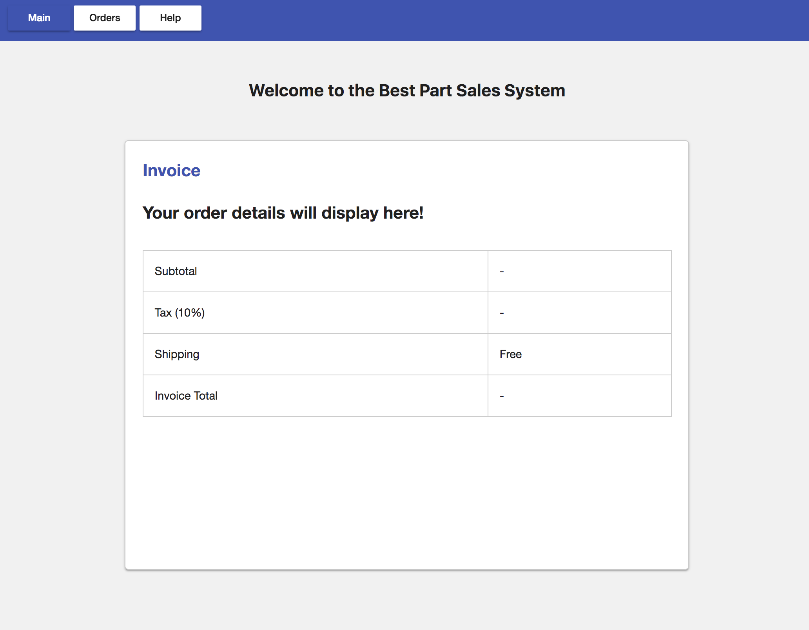
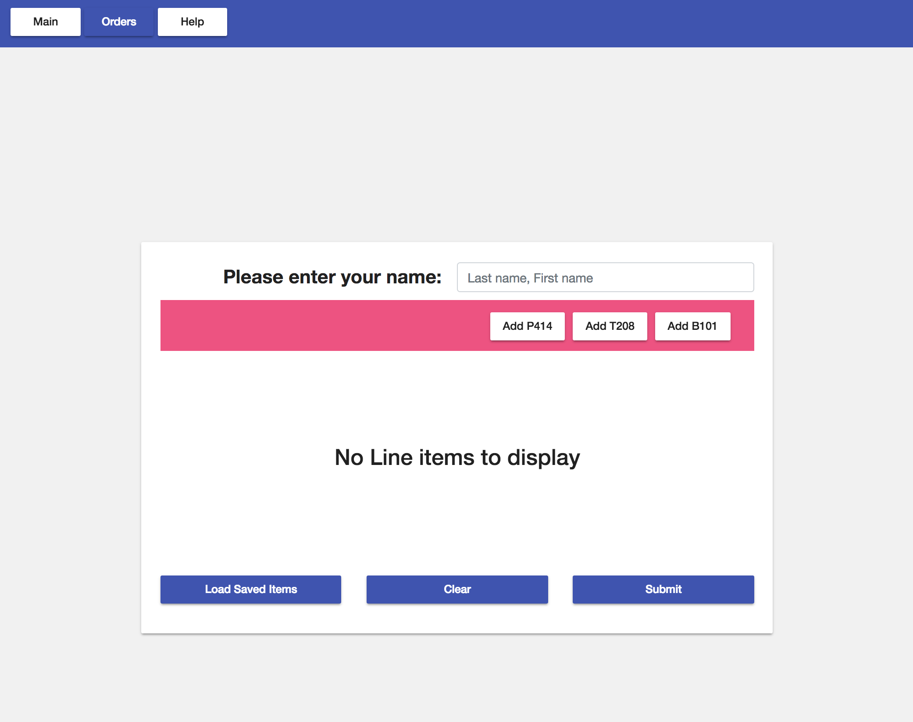
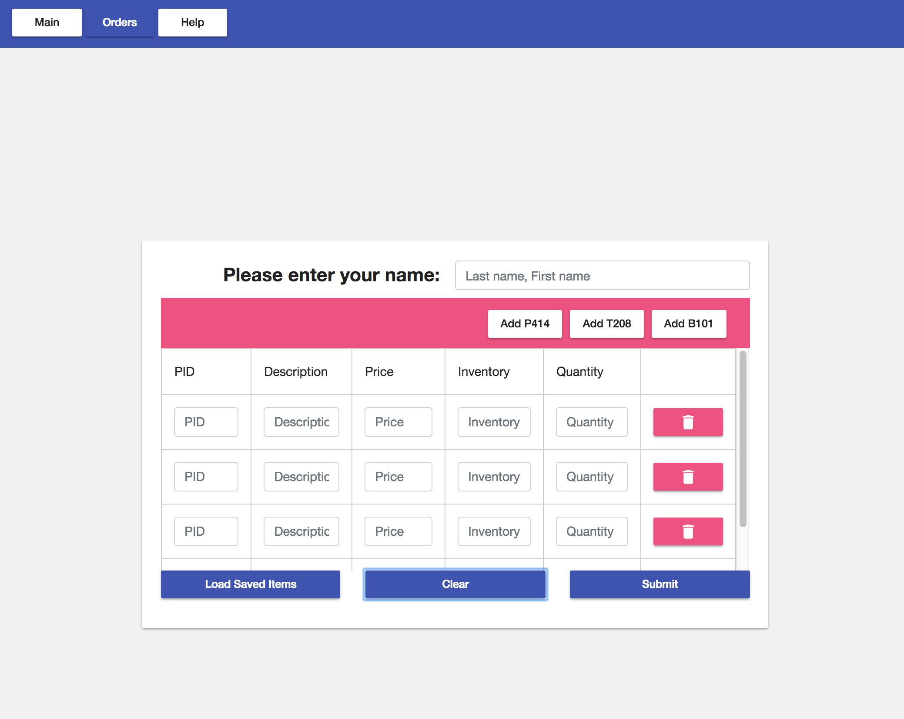
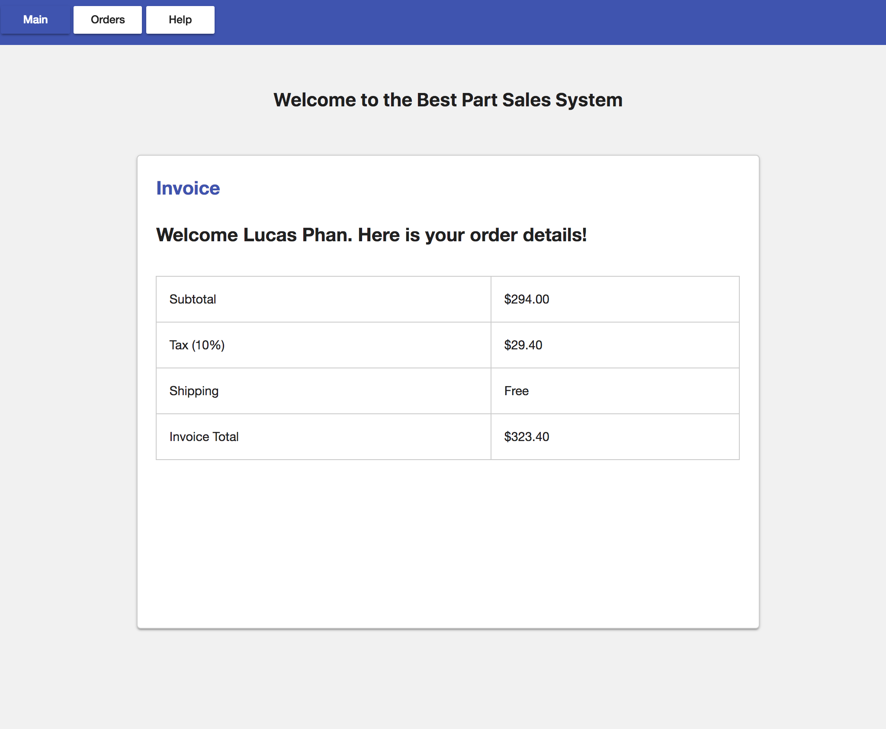
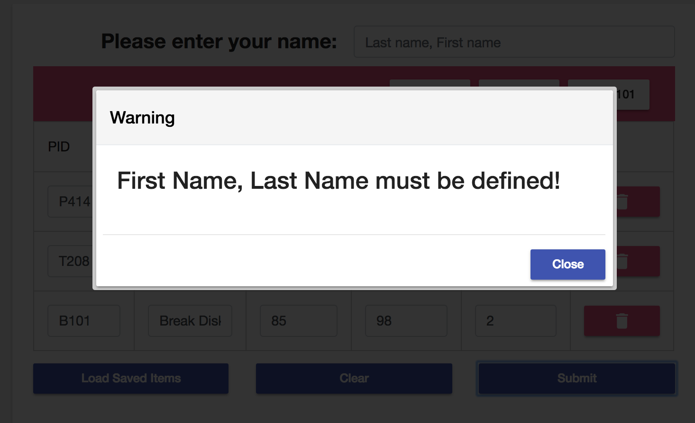
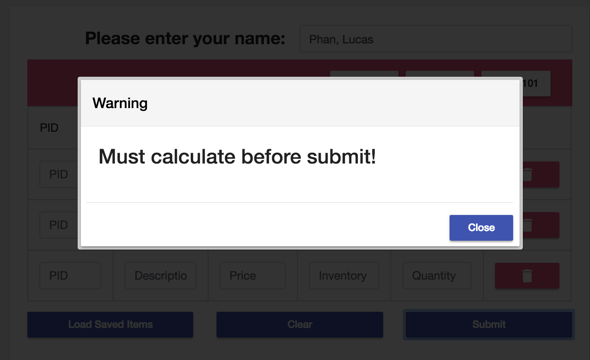

# Final


## Development server

Run `ng serve` for a dev server. Navigate to `http://localhost:4200/`. The app will automatically reload if you change any of the source files.

## Code scaffolding

Run `ng generate component component-name` to generate a new component. You can also use `ng generate directive|pipe|service|class|guard|interface|enum|module`.

## Build

Run `ng build` to build the project. The build artifacts will be stored in the `dist/` directory. Use the `--prod` flag for a production build.

## Running unit tests

Run `ng test` to execute the unit tests via [Karma](https://karma-runner.github.io).

## Running end-to-end tests

Run `ng e2e` to execute the end-to-end tests via [Protractor](http://www.protractortest.org/).

## Further help

To get more help on the Angular CLI use `ng help` or go check out the [Angular CLI README](https://github.com/angular/angular-cli/blob/master/README.md).


## Instructions

### Computer Solution Problem (250 points)

1. Written component 25pts (~ 25 minutes)
2. GITFlow component 25pts (~ 10 minutes)
3. Code component 200pts (~ 115 minutes)

You can use any resources including  your books, notes, and memos for completing this part of
the test; however, you cannot ask, share, or consult with anyone in the world. You cannot use
the Internet for any searches or file sharing. It must be your own work. Any violation will
automatically issue a zero on the Final Exam.

GUI for the application is fully provided for you and you should not have to write any CSS or new HTML elements. Pull the application source code as specified according to the GITFlow section of this document. Change html of the components items and write all necessary codes and complete the application.

Push all the files onto your GITHub repo and change name of the top folder to
“IS51Final” (corresponding to your GITHub repo) upon completion of final.

Make sure the computer, VS Code, and the files / application is all working properly with no errors or warnings.

### Code Component - Best Part Sales Project

You are hired to create a Web application to computerize Best Part sales process. The application should have a structure that stores the following part data: PID (a string), Description (a string), Price (a number) and Inventory (an number). The company currently carries only three parts as shown in the table below and the application should use an array of three custom objects (interface). If you don’t know how to use an array of three object variables, you can use  array of objects instead with 5 points penalty.

#### PID Description Price Inventory
2. B101 1/4 Pipe 12.99 30
3. T208 3/8 T Joint 64.99 74
4. B101 Brake Disk A 85.99 98

The data above is located in ```assets/orders.json``` for reference. 

Your application should allow the user to enter data for each part (part id and description) and its price and the quantity on hand (inventory). A Main form shown in the figure next page should show the results (invoice) for the order (orders page). When the user clicks on the “Order” menu, navigate to the “orders” page. When “Load Saved Items” button is clicked, use Angular’s HTTP module to fetch the json data from the orders.json file and display the content on the table. PID, Description, Price, and Inventory should be displayed inside text input. The user will enter any quantity to order for each part. When “Submit” button is clicked, navigate to the main page with the “Invoice” with the results of your order.

Help button displays a message, ```“This application is designed by <your name>. (C) 2018”``` in a “app-flex-modal” component (provided) or use an alert box less points.

When “Display Saved Items” button is clicked, the part data is read from “orders.json” file using
Angular’s HTTP module. Then the part information should be displayed as shown in the figure
below. Then, the user enters his/her name and any quantity to order for each part (Note: the format of name input ->; Lastname, Firstname; ex: Phan, Lucas). (comma with space between last name and first name) 

When “Clear” button is clicked, the Order form should be cleared (value set to null). 

When “Submit” button is clicked, calculate the subtotal, tax amount and total for the invoice (by calling a compute function) and navigate to the “Invoice” screen on the Main page upon successful validation. Display the calculated values from the Orders page in the invoice on the Main page. Perform string splicing to transform “LastName, FirstName” to “First Name Last Name” and display the welcome text: “Welcome <First Name> <Last Name>. Here is your order details!”. (See screenshots)

### Validation (see screenshots below)

1. Name input field not specified.
2. Name not containing a “, ”.
3. Input values within table null values.
4. Subtotal, tax amount and invoice total calculation

Show the corresponding error message using the “app-flex-modal”. Alert message could be use for reduce points.

### Add Additional Parts

The three buttons -> “Add P414, Add T208 and Add B101”, when click adds the corresponding part to the orders list with all fields (pid, description, price, inventory and quantity) matching to the corresponding part. Quantity however will be 1.


### Delete Part Item

When the delete button is pressed, delete the corresponding item from the list.

### Main Page (landing page)


### Orders Page (before loading saved items from orders.json)


### Orders Page (after loading saved items from orders.json)


### Orders Page (after clear button pressed)


### Main Page (after order has been submitted on the Orders page)


### Help Modal (show on Help button pressed)


### Delete Part Item


### Delete Part Item


### Delete Part Item


### Validation Errors



## Points Breakdown

1. Launch flex modal or alert (2pts reduced) showing about text 5pts
2. convert name passed from the Orders page to <First Name> <Last Name> and display text 5 pts
3. Calculate sub total, tax amount and total 15pts
4. perform input validation (use alert - 2pts reduced)
  ```
  (use alert - 2pts reduced for each of the four validation)
1. Name input field not specified. 5pts
2. Name not containing a “, ”. 5pts
3. Input values within table null values. 5pts
4. Subtotal, tax amount and invoice total calculation error 5pts
  ```
5. Clear the orders form 10pts
6. Add items 'P414', 'T208' and 'B101' to list when corresponding button is clicked 15pts
7. delete line item (order) when delete button is click 10 pts
8. read in the orders.json file and populate the list table with the initial orders (3) 15pts
9. Display calculated results on invoice (see screenshot) 5 pts